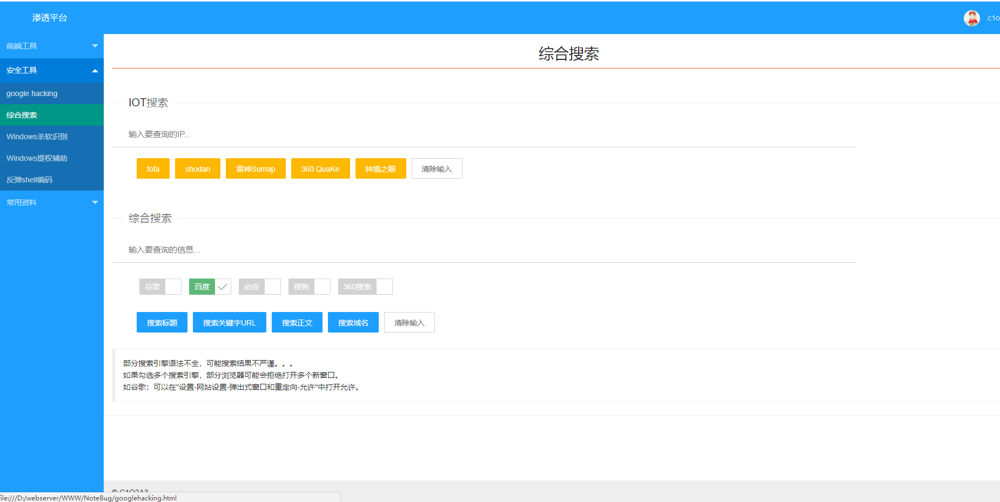

# README

## 免责声明
本工具仅面向合法授权的企业安全建设行为与个人学习行为，如您需要测试本工具的可用性，请自行搭建靶机环境。

在使用本工具进行检测时，您应确保该行为符合当地的法律法规，并且已经取得了足够的授权。请勿对非授权目标进行扫描。

如果发现上述禁止行为，我们将保留追究您法律责任的权利。

如您在使用本工具的过程中存在任何非法行为，您需自行承担相应后果，我们将不承担任何法律及连带责任。

在安装并使用本工具前，请您务必审慎阅读、充分理解各条款内容。

除非您已充分阅读、完全理解并接受本协议所有条款，否则，请您不要安装并使用本工具。您的使用行为或者您以其他任何明示或者默示方式表示接受本协议的，即视为您已阅读并同意本协议的约束。

## 前言

想着想弄一个纯JS+HTML写的，然后可以到处带走的小工具，于是这个项目就来了。

**整体框架：layui**
网站的整体思路参考了：[zjun的在线工具](https://tools.zjun.info/googlehacking/)

编码模块参考了： [P神的代码审计知识星球](https://govuln.com/tool/). 甚至某些都是照抄的。。
笑。。。

二维码生成引用了： [qrcodejs](https://github.com/davidshimjs/qrcodejs)

随机密码生成参考了百度的一些站点的样式。。。

XXXX生成也是参考了百度的一些站点。。。然后根据规律写了一下。。。

Google hacking模块参考了：[zjun的在线工具](https://tools.zjun.info/googlehacking/)

Windows杀软识别模块参考了：[zjun的在线工具](https://tools.zjun.info/googlehacking/)并且自己去
重组合了一下两个项目的字典 r00tSe7en的[get_AV](https://github.com/r00tSe7en/get_AV) 和 
gh0stkey 的[avList](https://github.com/gh0stkey/avList)

Windows提权辅助模块使用了：[gh0stkey / 的peAssist](https://github.com/gh0stkey/peAssist)

反弹shell工具模块参考了：[反弹shell生成](http://8.210.235.249/)

常用资料模块来自于百度还有朋友以及浏览器插件[hacktools](https://github.com/s7ckTeam/HackTools)

当然很多还用了很多其他的东西吧，我也有点记不住了

这个项目我有时候比较需要的，有时候去到客户现场，没网络的情况下需要使用到某些功能，来回切换网络有点儿烦，而且还有广告（这个真不是主要原因）

当然，这也是个重复造轮子的项目，可能还没甚鸟用。。。

## 截图





## docker版本

docker版本的我也上传了

```bash
docker pull c1o2a3/bug
docker run -d -p 80:80 c1o2a3/bug
```

